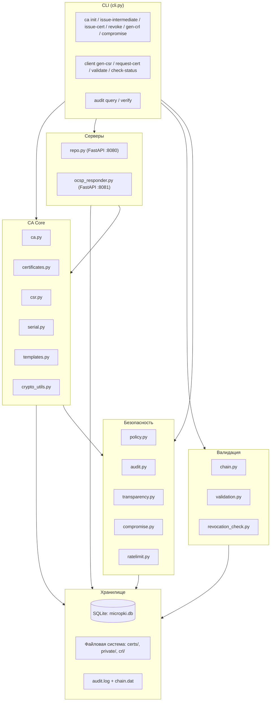

# MicroPKI

> Минимальная, но полнофункциональная реализация инфраструктуры открытых ключей (PKI) на Python — для обучения, демонстрации и лабораторных работ.

[](https://github.com/dankapust/MicroPKI/actions/workflows/ci.yml)

---

## Возможности

- **Корневой УЦ (Root CA)** — самоподписанный RSA-4096 или ECC P-384.
- **Промежуточный УЦ (Intermediate CA)** — подписан корневым, с ограничением pathLen.
- **Сертификаты конечных сущностей** — шаблоны: `server`, `client`, `code_signing`, `ocsp`.
- **Генерация CSR** — клиент создаёт запрос на сертификат (PKCS#10).
- **Сервер репозитория** — HTTP REST API для распространения сертификатов и CRL (FastAPI).
- **Отзыв сертификатов и CRL** — с сохранением причины отзыва по RFC 5280.
- **OCSP-ответчик** — HTTP сервер, отвечает по RFC 6960 (GET & POST).
- **Валидация цепочки** — полная проверка по RFC 5280 (подпись, сроки, BasicConstraints, pathLength, KeyUsage).
- **Проверка отзыва** — OCSP → CRL fallback, с извлечением AIA/CDP из сертификата.
- **Политики безопасности** — минимальные размеры ключей, сроки, запрет wildcards, проверка алгоритмов.
- **Аудит-логирование** — NDJSON с криптографической цепочкой хешей SHA-256.
- **Certificate Transparency (симуляция)** — лог выпущенных сертификатов.
- **Компрометация ключей** — блокировка, экстренный CRL.
- **Rate limiting** — ограничение запросов по IP (token bucket).
- **TLS-интеграция** — сертификаты пригодны для реальных TLS-соединений.
- **Подпись кода** — выпуск code signing сертификатов, подпись и проверка файлов.

---

## Архитектура



---

## Требования

- **Python** 3.10+
- **cryptography** ≥ 3.0
- **fastapi** и **uvicorn** (для серверов)
- **requests** (для клиентских команд)
- **OpenSSL** (для демонстрации TLS и подписи кода)

Полный список — в `requirements.txt`.

---

## Установка

```bash
# Клонировать репозиторий
git clone https://github.com/dankapust/MicroPKI.git
cd MicroPKI

# Создать виртуальное окружение
# Linux/macOS:
python3 -m venv venv && source venv/bin/activate
# Windows (рекомендуется лаунчер py):
# py -m venv venv
# .\venv\Scripts\Activate.ps1

# Установить зависимости
pip install -r requirements.txt

# Установить пакет в dev-режиме
pip install -e .
```

---

## Конфигурация

Отдельного файла конфигурации приложения нет: пути к БД, каталогам, парольным файлам и параметры выпуска задаются флагами CLI (см. `--help` у каждой команды). Правила политики (минимальные размеры ключей, сроки, ограничения SAN) реализованы в коде (`micropki/policy.py`).

---

## CLI Reference

### `micropki ca` — Операции удостоверяющего центра

| Команда | Описание |
|---------|----------|
| `ca init` | Создание самоподписанного корневого УЦ |
| `ca issue-intermediate` | Создание промежуточного УЦ |
| `ca issue-cert` | Выпуск сертификата конечной сущности |
| `ca issue-ocsp-cert` | Выпуск сертификата для OCSP-ответчика |
| `ca verify` | Проверка самоподписанного сертификата |
| `ca verify-chain` | Проверка цепочки сертификатов |
| `ca list-certs` | Список сертификатов в БД |
| `ca show-cert` | Показать PEM сертификата по серийному номеру |
| `ca revoke` | Отзыв сертификата |
| `ca gen-crl` | Генерация CRL |
| `ca check-revoked` | Проверка статуса отзыва в БД |
| `ca compromise` | Симуляция компрометации ключа |

### `micropki client` — Клиентские инструменты

| Команда | Описание |
|---------|----------|
| `client gen-csr` | Генерация ключа и CSR |
| `client request-cert` | Отправка CSR через API и получение сертификата |
| `client validate` | Валидация цепочки (chain / full с OCSP/CRL) |
| `client check-status` | Проверка статуса отзыва (OCSP → CRL fallback) |

### `micropki repo` — Сервер репозитория

| Команда | Описание |
|---------|----------|
| `repo serve` | Запуск HTTP-сервера (порт 8080 по умолчанию) |

### `micropki ocsp` — OCSP-ответчик

| Команда | Описание |
|---------|----------|
| `ocsp serve` | Запуск OCSP-ответчика (порт 8081 по умолчанию) |

### `micropki db` — Управление базой данных

| Команда | Описание |
|---------|----------|
| `db init` | Инициализация SQLite базы данных |

### `micropki audit` — Аудит

| Команда | Описание |
|---------|----------|
| `audit query` | Запрос аудит-лога (фильтры: `--operation`, `--level`, `--from`, `--to`) |
| `audit verify` | Проверка целостности аудит-лога |

### `micropki demo`

| Команда | Описание |
|---------|----------|
| `demo run` | Полный автоматический сценарий (см. раздел «Демонстрация») |

Для подробной справки по любой команде используйте `--help`:

```bash
micropki ca init --help
micropki client validate --help
```

---

## Быстрый старт

```powershell
# 1. Создать пароли
mkdir secrets -Force
Set-Content -Path secrets\ca.pass -Value "root-passphrase" -NoNewline
Set-Content -Path secrets\inter.pass -Value "intermediate-passphrase" -NoNewline

# 2. Корневой УЦ
micropki ca init --subject "/CN=Demo Root CA" --key-type rsa --key-size 4096 --passphrase-file secrets\ca.pass --out-dir .\pki

# 3. Промежуточный УЦ
micropki ca issue-intermediate --root-cert pki\certs\ca.cert.pem --root-key pki\private\ca.key.pem --root-pass-file secrets\ca.pass --subject "/CN=Demo Intermediate CA" --key-type rsa --key-size 4096 --passphrase-file secrets\inter.pass --out-dir .\pki --validity-days 1825 --pathlen 0

# 4. Серверный сертификат
micropki ca issue-cert --ca-cert pki\certs\intermediate.cert.pem --ca-key pki\private\intermediate.key.pem --ca-pass-file secrets\inter.pass --template server --subject "/CN=example.com" --san dns:example.com --out-dir pki\certs

# 5. Проверка цепочки
micropki ca verify-chain --leaf pki\certs\example.com.cert.pem --intermediate pki\certs\intermediate.cert.pem --root pki\certs\ca.cert.pem
```

---

## Демонстрация (Demo)

### Автоматический запуск

Запускайте из корня репозитория (где установлен пакет `micropki`), чтобы модуль находился через `pip install -e .`.

```bash
# Linux/macOS
python3 demo/demo.py

# Windows (лаунчер py)
py demo/demo.py
```

Эквивалент через CLI:

```bash
micropki demo run
# Windows: py -m micropki demo run
```

**Важно (Windows):** скрипт создаёт временную рабочую папку в каталоге `TEMP` системы (`%TEMP%\micropki_demo_*`), а не рядом с репозиторием. Так избегаются ошибки доступа (`PermissionError`) при удалении в папках, синхронизируемых OneDrive или заблокированных антивирусом.

Скрипт выполняет полный сценарий:

1. **Настройка окружения** — временный каталог и файлы паролей (без запросов с клавиатуры).
2. **Инициализация Root CA** — RSA-4096, самоподписанный.
3. **Инициализация Intermediate CA** — подписан Root CA.
4. **Выпуск сертификатов** — server, client, OCSP.
5. **Запуск серверов** — репозиторий (8080) и OCSP (8081), ожидание готовности по TCP.
6. **Валидация** — полная проверка цепочки с OCSP.
7. **Политика** — выпуск клиентского сертификата с недопустимым SAN (`uri:` для шаблона `client`) **должен быть отклонён**.
8. **Отзыв** — серверный сертификат отзывается (`keyCompromise`).
9. **Проверка отзыва** — повторная валидация **должна провалиться** (ожидается ненулевой код выхода у `client validate`).
10. **Целостность аудит-лога** — `audit verify`.
11. **Остановка серверов** и удаление временного каталога.

На каждый шаг выводится `[PASS]` или `[FAIL]`. Повторный запуск не конфликтует со старыми данными — каждый прогон использует новый временный каталог.

---

## TLS-интеграция

### Демонстрация TLS-сервера

После выпуска серверного сертификата (шаги из «Быстрый старт»):

```bash
# 1. Запустить простой HTTPS-сервер (Python)
python3 -c "
import ssl, http.server
ctx = ssl.SSLContext(ssl.PROTOCOL_TLS_SERVER)
ctx.load_cert_chain('pki/certs/example.com.cert.pem', 'pki/certs/example.com.key.pem')
server = http.server.HTTPServer(('127.0.0.1', 8443), http.server.SimpleHTTPRequestHandler)
server.socket = ctx.wrap_socket(server.socket, server_side=True)
print('HTTPS server running on https://127.0.0.1:8443')
server.serve_forever()
"
# Windows: замените python3 на py

# 2. В другом терминале — подключиться, доверяя только Root CA (без -k)
curl --cacert pki/certs/ca.cert.pem https://127.0.0.1:8443/

# Или через openssl:
openssl s_client -connect 127.0.0.1:8443 -CAfile pki/certs/ca.cert.pem -verify_return_error
```

### Демонстрация отзыва через TLS

```bash
# 1. Отозвать серверный сертификат
micropki ca revoke <SERIAL_HEX> --reason keyCompromise --force

# 2. Сгенерировать свежий CRL
micropki ca gen-crl --ca-cert pki/certs/intermediate.cert.pem --ca-key pki/private/intermediate.key.pem --ca-pass-file secrets/inter.pass --out-dir pki

# 3. Проверить с CRL — клиент должен отказать
openssl verify -crl_check -CRLfile pki/crl/intermediate.crl.pem -CAfile pki/certs/ca.cert.pem -untrusted pki/certs/intermediate.cert.pem pki/certs/example.com.cert.pem
# Ожидаемый результат: certificate revoked
```

### OCSP Stapling (симуляция)

```bash
# openssl s_server с OCSP stapling
openssl s_server -cert pki/certs/example.com.cert.pem -key pki/certs/example.com.key.pem -CAfile pki/certs/intermediate.cert.pem -status_url http://127.0.0.1:8081 -accept 8443

# Клиент проверяет stapled OCSP
openssl s_client -connect 127.0.0.1:8443 -status -CAfile pki/certs/ca.cert.pem
```

---

## Подпись кода (Code Signing)

### 1. Выпуск сертификата для подписи кода

```powershell
micropki ca issue-cert --ca-cert pki\certs\intermediate.cert.pem --ca-key pki\private\intermediate.key.pem --ca-pass-file secrets\inter.pass --template code_signing --subject "/CN=MicroPKI Code Signer" --out-dir pki\certs
```

### 2. Подпись файла

```bash
# Подписать скрипт (detached SHA-256 signature)
openssl dgst -sha256 -sign pki/certs/MicroPKI_Code_Signer.key.pem -out script.sh.sig script.sh
```

### 3. Проверка подписи

**Linux/macOS (bash)** — процесс-подстановка:

```bash
openssl dgst -sha256 -verify <(openssl x509 -in pki/certs/MicroPKI_Code_Signer.cert.pem -pubkey -noout) -signature script.sh.sig script.sh
# Ожидаемый результат: Verified OK
```

**Windows (PowerShell)** — сначала экспортировать публичный ключ в файл:

```powershell
openssl x509 -in pki\certs\MicroPKI_Code_Signer.cert.pem -pubkey -noout -out codesign.pub.pem
openssl dgst -sha256 -verify codesign.pub.pem -signature script.sh.sig script.sh
```

Проверка после порчи файла — должна **провалиться**:

```bash
echo "tampered" >> script.sh
openssl dgst -sha256 -verify codesign.pub.pem -signature script.sh.sig script.sh
# Ожидаемый результат: Verification Failure
```

### 4. Проверка отзыва (необязательно)

```bash
# Отозвать code signing сертификат
micropki ca revoke <CODE_SIGNER_SERIAL> --reason keyCompromise --force

# Проверить статус через OCSP
micropki client check-status --cert pki/certs/MicroPKI_Code_Signer.cert.pem --ca-cert pki/certs/intermediate.cert.pem --ocsp-url http://127.0.0.1:8081
# Ожидаемый результат: Status: revoked
```

---

## API Reference (Repository Server)

Сервер запускается командой `micropki repo serve`.

| Метод | Путь | Описание |
|-------|------|----------|
| `GET` | `/` | Статус сервера |
| `GET` | `/certificate/{serial_hex}` | Получить сертификат по серийному номеру (PEM) |
| `GET` | `/ca/root` | Получить сертификат Root CA |
| `GET` | `/ca/intermediate` | Получить сертификат Intermediate CA |
| `GET` | `/crl?ca=intermediate` | Получить CRL |
| `POST` | `/request-cert` | Выпустить сертификат по CSR (JSON: `{csr_pem, template}`) |

### Примеры

```bash
# Статус
curl http://localhost:8080/

# Получить Root CA
curl http://localhost:8080/ca/root -o root.pem

# Получить CRL
curl http://localhost:8080/crl?ca=intermediate -o intermediate.crl.pem

# Выпустить сертификат через CSR
curl -X POST http://localhost:8080/request-cert \
  -H "Content-Type: application/json" \
  -d '{"csr_pem": "-----BEGIN CERTIFICATE REQUEST-----\n...\n-----END CERTIFICATE REQUEST-----", "template": "server"}'
```

---

## Аудит и безопасность

### Аудит-лог

Все операции записываются в `./pki/audit/audit.log` (NDJSON) с SHA-256 хеш-цепочкой:

```bash
micropki audit query --operation issue_certificate --format json
micropki audit verify
```

### Политики безопасности

| Политика | Правило |
|----------|---------|
| RSA Root | ≥ 4096 бит |
| RSA Intermediate | ≥ 3072 бит |
| RSA End-entity | ≥ 2048 бит |
| ECC Root/Intermediate | P-384 |
| ECC End-entity | P-256 или P-384 |
| Срок Root | ≤ 3650 дней |
| Срок Intermediate | ≤ 1825 дней |
| Срок End-entity | ≤ 365 дней |
| Wildcard SAN | Запрещён |
| SHA-1 | Запрещён |

### Rate Limiting

```bash
micropki repo serve --rate-limit 5 --rate-burst 10
micropki ocsp serve --rate-limit 10 --rate-burst 20
```

---

## Замечания по безопасности (Security Considerations)

> ⚠️ **Данная система предназначена для образовательных целей и НЕ рекомендуется для использования в production без дополнительного усиления.**

1. **Закрытые ключи конечных сущностей хранятся без шифрования.** Это сделано для удобства демонстрации. В production ключи должны храниться в HSM или с паролем.

2. **Пароли Root/Intermediate CA читаются из файлов.** Файлы паролей должны иметь права `0600` и находиться вне репозитория. В production используйте секретные менеджеры (Vault, AWS KMS).

3. **OCSP-ответчик не использует HTTPS.** Нет защиты транспортного уровня. В production OCSP-ответчик должен быть за reverse proxy с TLS.

4. **Rate limiting базовый.** Token bucket per IP не защитит от распределённых атак. В production используйте CDN/WAF.

5. **Целостность аудит-лога основана на хеш-цепочке.** Файл не подписан и может быть удалён. В production используйте append-only хранилища (WORM) или блокчейн.

6. **Certificate Transparency — симуляция.** Нет дерева Меркла, публичного лога, или gossip-протокола. Используется простой текстовый лог.

7. **Нет аутентификации на API `/request-cert`.** Любой может запросить сертификат. В production требуется mTLS, OAuth или API-ключи.

---

## Тестирование

### Запуск тестов

Требуется установленный **OpenSSL** в `PATH` для части интеграционных проверок (TLS/внешние команды при необходимости).

```bash
# Все тесты
pytest tests/ -v

# Windows
py -m pytest tests/ -v

# С покрытием кода (цель CI: покрытие строк ≥ 80 %)
pytest tests/ -v --cov=micropki --cov-report=term-missing --cov-fail-under=80

# Performance-тесты (1000 сертификатов)
pytest tests/test_performance.py -v --run-perf -s

# HTML-отчёт о покрытии
pytest tests/ --cov=micropki --cov-report=html
# Открыть htmlcov/index.html
```

### Структура тестов

| Файл | Описание |
|------|----------|
| `test_ca_init_cli.py` | CLI и инициализация Root CA |
| `test_certificates.py` | Построение X.509 |
| `test_chain.py` | Валидация цепочки |
| `test_crl.py` | Генерация CRL |
| `test_crypto_utils.py` | Криптографические утилиты |
| `test_database.py` | SQLite операции |
| `test_integration.py` | Интеграционные тесты |
| `test_ocsp.py` | OCSP-ответчик |
| `test_repository.py` | Репозиторий |
| `test_security_hardening.py` | Политики, аудит, CT |
| `test_templates.py` | Шаблоны сертификатов |
| `test_validation.py` | Валидация пути |
| `test_edge_cases.py` | Крайние случаи: expired, wrong EKU, malformed input |
| `test_performance.py` | 1000 сертификатов, производительность |

### Требования к покрытию

Целевое покрытие: **≥ 80%** line coverage. Проверяется в CI.

---

## Структура проекта

```
MicroPKI/
├── micropki/
│   ├── __init__.py
│   ├── __main__.py          # python -m micropki
│   ├── cli.py               # CLI парсер
│   ├── ca.py                # Root CA, Intermediate CA, выпуск сертификатов
│   ├── certificates.py      # X.509 builder, parse DN
│   ├── chain.py             # Валидация цепочки
│   ├── client.py            # gen-csr, request-cert, validate, check-status
│   ├── compromise.py        # Компрометация ключей
│   ├── crl.py               # Генерация CRL
│   ├── crypto_utils.py      # PEM, ключи, подписи
│   ├── csr.py               # CSR генерация и подписание
│   ├── database.py          # SQLite: certificates, crl_metadata, compromised_keys
│   ├── logger.py            # Логирование
│   ├── ocsp.py              # OCSP-ответы (RFC 6960)
│   ├── ocsp_responder.py    # OCSP HTTP-сервер (FastAPI)
│   ├── policy.py            # Политики безопасности
│   ├── ratelimit.py         # Rate limiting (token bucket)
│   ├── repo.py              # Repository HTTP-сервер (FastAPI)
│   ├── repository.py        # CRUD сертификатов в БД
│   ├── revocation.py        # Внутренний отзыв
│   ├── revocation_check.py  # OCSP/CRL fallback, AIA/CDP extraction
│   ├── serial.py            # Серийные номера
│   ├── templates.py         # server, client, code_signing, ocsp шаблоны
│   ├── transparency.py      # Certificate Transparency (симуляция)
│   └── validation.py        # RFC 5280 path validation
├── tests/                   # pytest test suite
├── demo/
│   └── demo.py              # Автоматический демо-скрипт
├── .github/workflows/
│   └── ci.yml               # GitHub Actions CI
├── requirements.txt
├── pyproject.toml
├── Makefile
├── LICENSE                  # MIT
└── README.md                # Этот файл
```

---

## Ссылки и благодарности

- [RFC 5280 — Internet X.509 PKI Certificate and CRL Profile](https://www.rfc-editor.org/rfc/rfc5280)
- [RFC 6960 — Online Certificate Status Protocol (OCSP)](https://www.rfc-editor.org/rfc/rfc6960)
- [RFC 6962 — Certificate Transparency](https://www.rfc-editor.org/rfc/rfc6962)
- [Python cryptography library](https://cryptography.io/)
- [FastAPI](https://fastapi.tiangolo.com/)
- [OpenSSL](https://www.openssl.org/)

---

## Лицензия

MIT License. См. файл [LICENSE](LICENSE).
